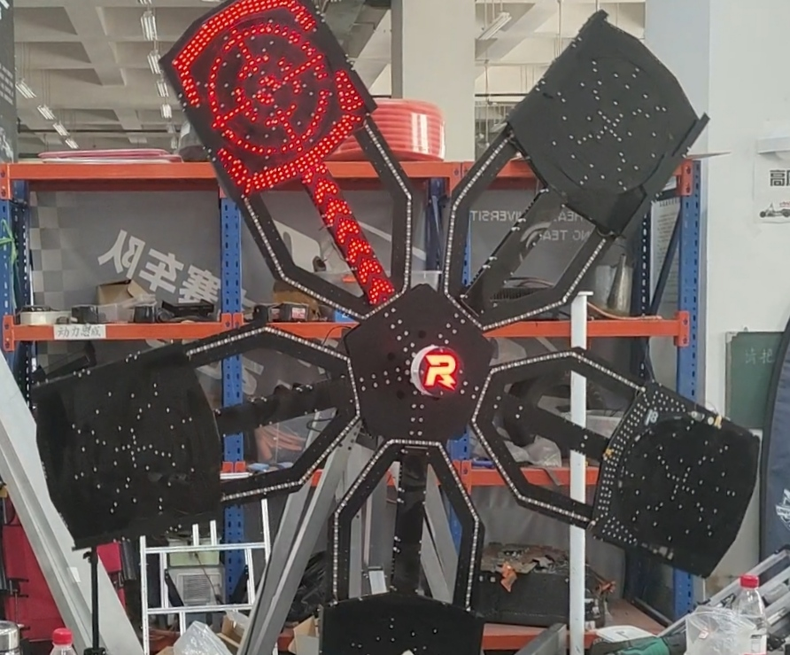
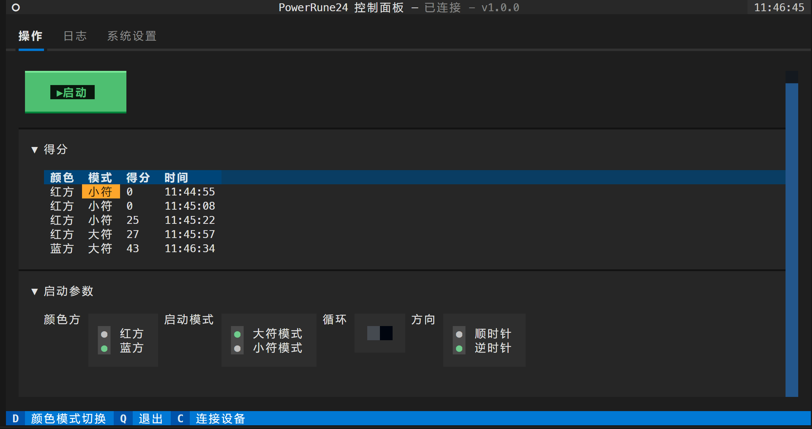
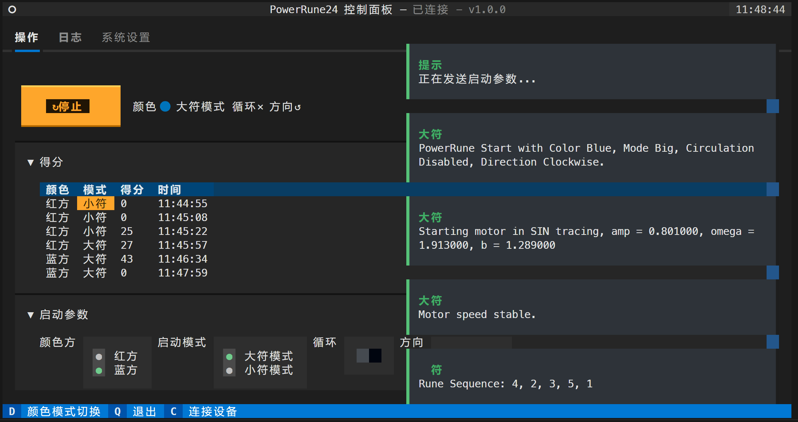
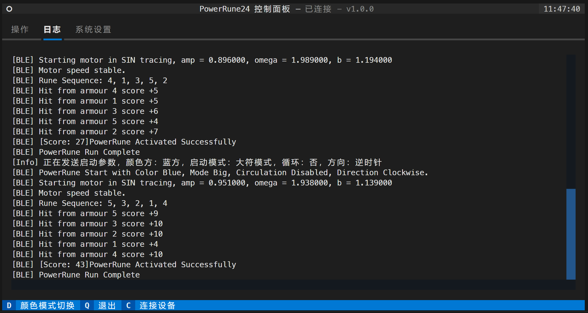

# PowerRune 24
> 无线通讯功能仅供大能量机关分布式控制使用，使用时请注意不要触犯比赛规则。移植使用时请注意通讯信道的合法性和安全性，防止干扰其他设备或者被恶意控制。


# 介绍
基于ESP-IDF的24赛季大能量机关，机关各部件之间通过无线连接，支持完整的操作模式、方向和灯效调整功能，支持蓝牙参数整定、环数成绩获取、OTA升级。

# 快速使用入门
## PowerRune Operator部署
### 平台要求
- Windows或Linux
- 支持蓝牙BLE
### 环境配置
#### 1. 安装Python 3.7以上版本，并配置python、pip的环境变量。
基础操作，自行上网搜索即可。
#### 2. 执行安装脚本。
```shell
git clone https://gitee.com/chenyuwuai/powerrune24.git
```
```shell
cd ./powerrune24/PowerRune24-Operator/
```
```shell
./install.sh
```
- Windows用户请使用`install.bat`。
- Linux用户请使用`install.sh`。
- 本脚本会自动安装所需的Textual和Bleak库。
#### 3. 运行PowerRune Operator。
```shell
python pr-24-operator.py
```
## 快速使用
### 1. 连接大符电源
确保大符电源已经开启。
- 将大符移动到目标位置。
- 确认大符周围净空，防止运转中干涉。
- 将大符`220V`电源插头插入电源插座。
- 确认大符电源指示灯亮起，或听到风扇正常运转声音。
- 如果需要OTA升级，在开机前请配置OTA使用的Wifi，SSID配置为`3SE-120`，密码配置为`roboclub`，加密方式配置为`WPA2`，连接频段配置为`2.4GHz`，上电后，大符将连接Wifi，自动更新。
- 开源Fork有需要时请务必注意修改OTA地址，修改方式为(修改menuconfig中的默认OTA地址/运行时通过BLE特征值修改UUID_URL 0x2AA6的内容)。

上电后大符将进行自动更新和初始化，完成后，大符R标将显示为待命状态，此时BLE进入可以连接状态。
### 2. 连接PowerRune Operator
- 打开PowerRune Operator。
- 软件会自动执行连接操作，连接成功后，软件会显示大符的状态信息。
- 如果连接失败，请检查大符电源是否正常，是否完成初始化，是否在可连接状态，是否正在更新。
- 如果初次连接失败，请尝试按C重新连接，或者重启大符电源。
- 如果多次连接失败，请联系技术支持。
### 3. 操作大符
- 选择相应的启动参数之后，点击`启动`按钮，大符将开始运行。

- 大符运行过程中，可以通过`停止`按钮停止大符运行。
- 大符运行时产生的环数成绩会显示在软件界面上。

- 大符运行时，可以手动观察大符的运行日志，分析击打结果。

### 4. OTA升级、参数整定
该部分功能未在PowerRune Operator内开放。

如有需要，请联系技术支持。

支持调整的参数包括：
- PID参数
- 靶环亮度
- 靶臂亮度
- 流水灯亮度
- R标亮度
- 开机自动OTA升级开关
- OTA Wifi配置

# 已知问题
### 0. 受设备蓝牙PHY天线发射功率、天线布置、无线环境等因素影响，部分笔记本电脑上在打符点距离上蓝牙会出现间歇性断联，请尝试更换设备或者联系技术支持使用手机手动开符。
### 1. PowerRune Operator报错。
- 请检查是否已经安装了所需的库，包括textual和bleak。
- 请尝试更换设备，因为某些系统平台(如Android)上的蓝牙驱动无法由bleak库调用。
- 尝试重启程序，因为蓝牙异常断开时没有完善断联检测，会报错。
### 2. 大符靶子工作异常，似乎某些扇叶出现了重启，击打无反应，或者靶子无法停止。
- 请不要频繁击打，因为大符击打的中断过度激活会导致靶子重启。(问题已解决)
- 靶子异常重启后，由于通信机制设置，防止数据不安全或者紊乱出现，用户需要手动切断电源，等待5秒后重新连接电源，等待靶子自动初始化。
- 请检查大符周围是否有干涉物，是否有异物进入靶子内部。
- 请检查大符电源是否正常，运行过程中是否有异常灯效、异常声音或者异常气味。如果有异常，请立即切断电源，不要重新连接电源，并立即联系技术支持。
### 3. Operator提示的方向与大符BLE提示的方向不一致。(问题已解决)
- 请以Operator上位机提示的方向为准。大符BLE提示的方向有误是开发阶段的遗留问题，不影响使用。
### 4. 大符开机时有环为绿色。
- 受打击次数影响，部分键轴会不可避免地损坏，大符系统会自动检测损坏键轴并屏蔽环上的输入信号，并在开机、OTA操作时提示损坏区域。少量绿色环不会影响实际操作，但是如果绿色环面积过大，则需要维护更换键轴。
# 贡献
1. 3SE 程浩 扇叶PCB&程序、R标PCB&程序、电机控制板程序、电控&通讯框架
2. 3SE 陈申 电机控制板、分电板
3. 3SE 张邦哲 BLE通讯框架
4. 3SE 郁泽智 机械设计